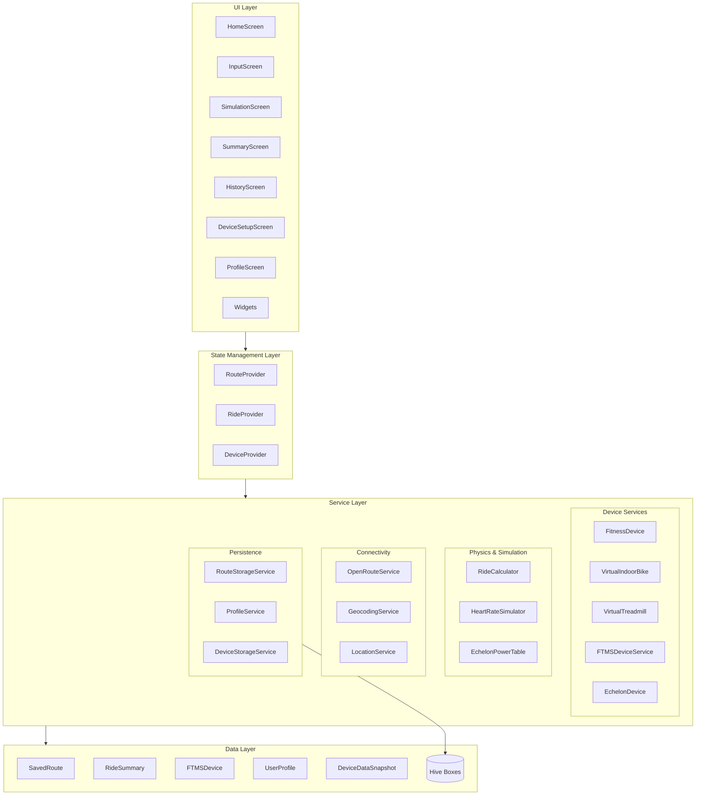
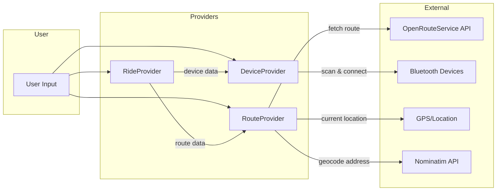
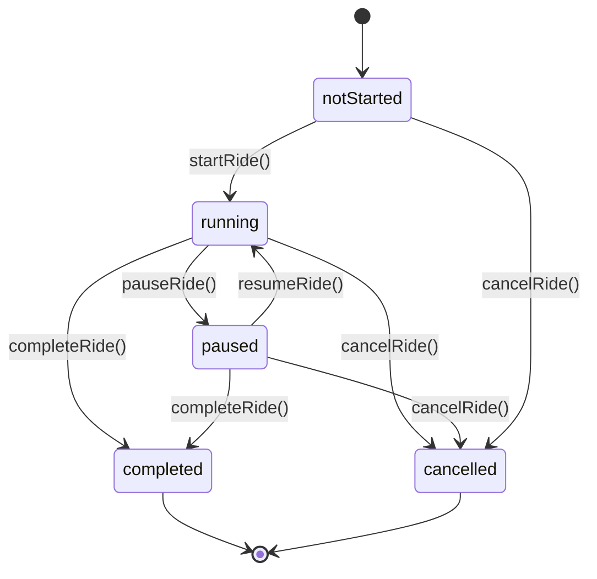
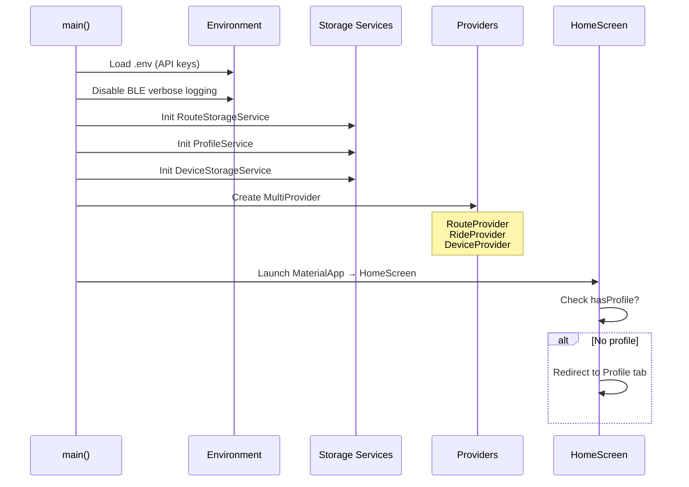
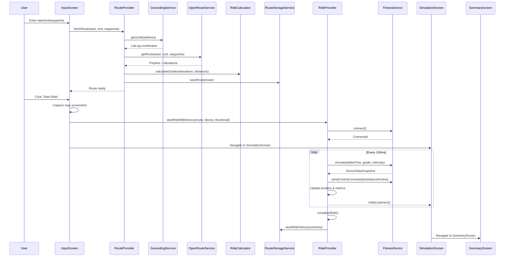
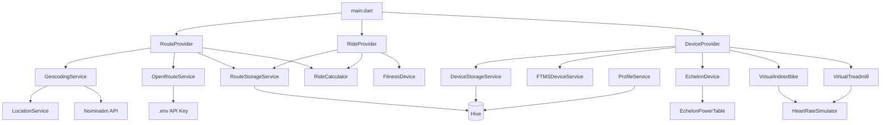
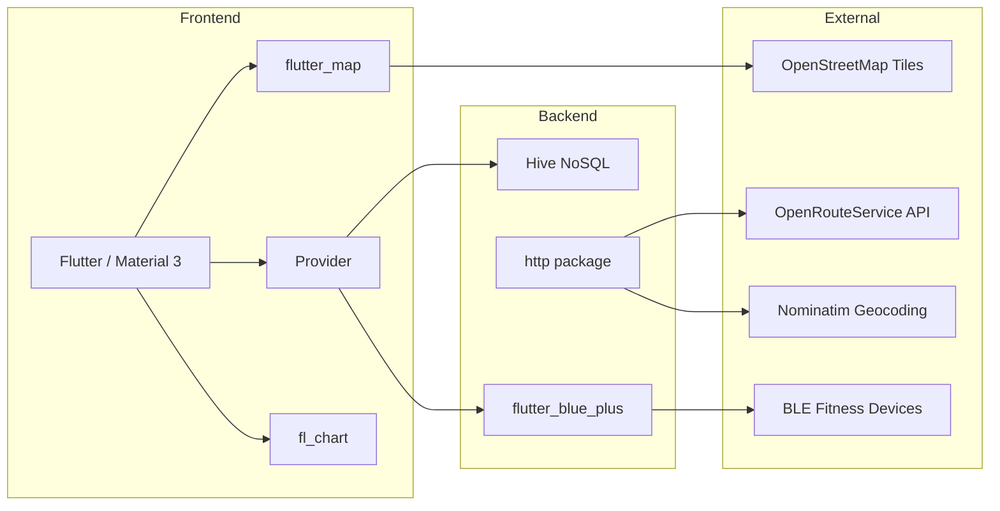

# Architecture

## Overview

Free Ride follows a layered architecture with clear separation of concerns. The application is built using Flutter's Provider pattern for state management, Hive for local persistence, and a service layer that encapsulates business logic, device communication, and external API integration.

## Layer Diagram

## Component Interaction

## Design Patterns

| Pattern | Where Used | Purpose |
|---------|-----------|---------|
| **Provider (ChangeNotifier)** | RouteProvider, RideProvider, DeviceProvider | Reactive state management for UI updates |
| **Abstract Factory** | FitnessDevice interface + device detectors | Create device instances without coupling to concrete types |
| **Command Pattern** | ControlCommand sealed class (SetResistance, SetIncline) | Encapsulate device control instructions |
| **Strategy Pattern** | Device detectors list in DeviceProvider | Pluggable device detection algorithms |
| **Observer** | BLE connectionState streams | Monitor device connection for auto-reconnect |
| **Repository** | RouteStorageService, ProfileService, DeviceStorageService | Abstract data persistence behind service interfaces |
| **State Machine** | RideProvider (RideStatus enum) | Manage ride lifecycle transitions |

## State Machine: Ride Lifecycle

## Initialization Flow

## Data Flow: Route Creation to Ride Completion

## Dependency Graph

## Technology Stack Diagram

