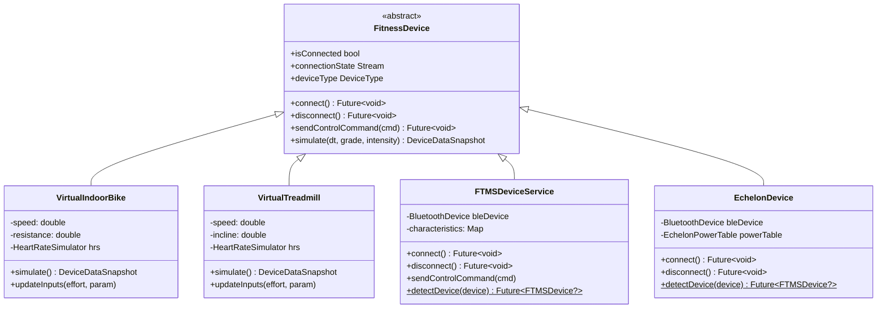
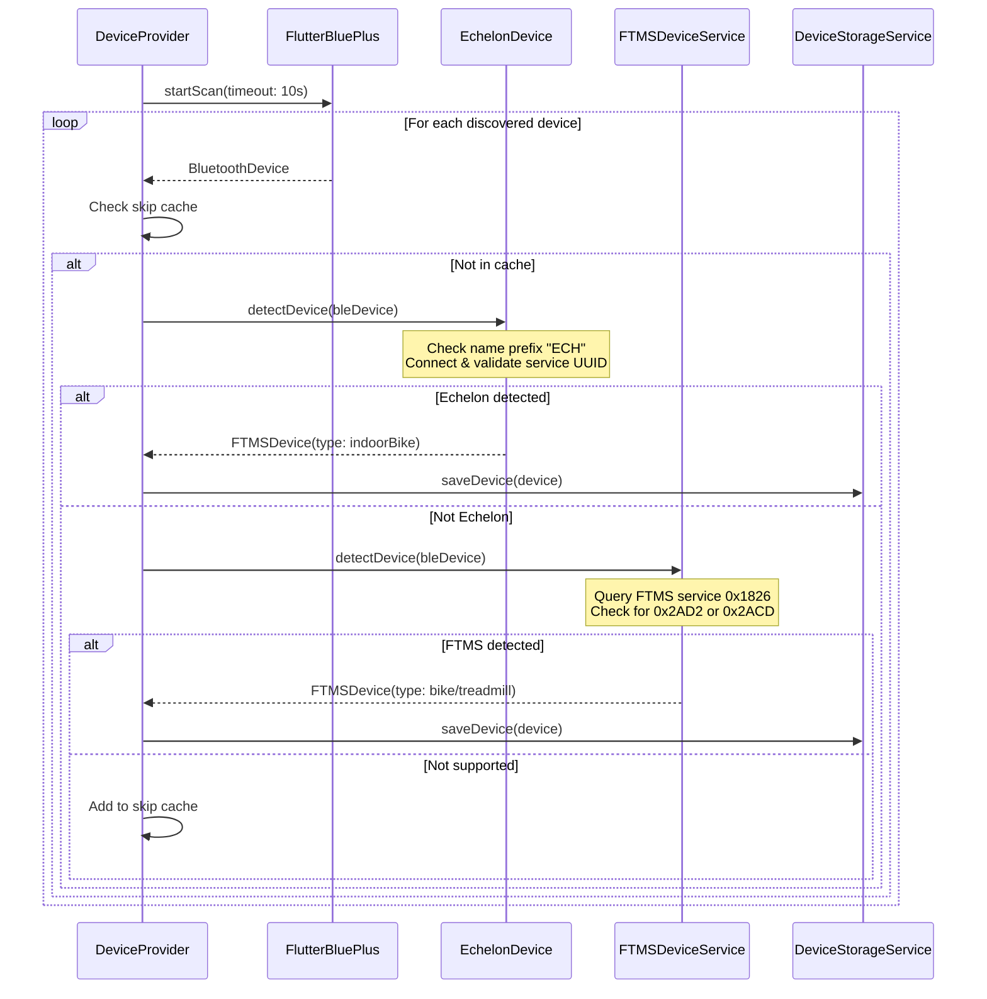
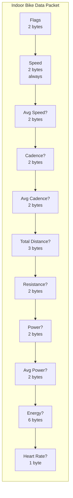
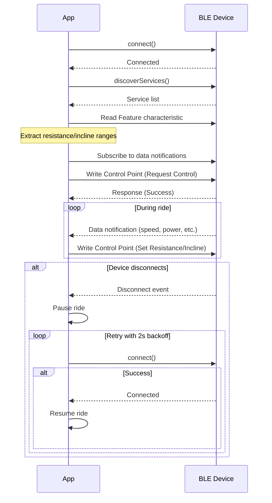
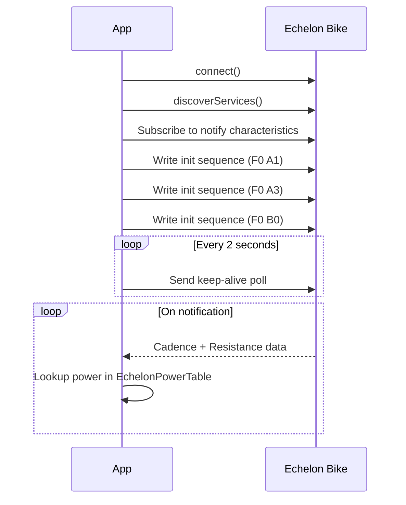
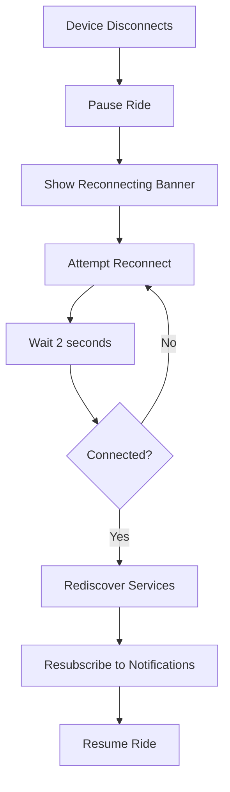

# Bluetooth Integration

Free Ride supports three categories of fitness devices: virtual simulators, standard FTMS (Fitness Machine Service) devices, and Echelon proprietary bikes.

## Device Hierarchy

## Device Detection Flow

---

## FTMS Protocol

The [Fitness Machine Service (FTMS)](https://www.bluetooth.com/specifications/specs/fitness-machine-service-1-0/) is a Bluetooth SIG standard for fitness equipment.

### Service & Characteristics

| UUID | Name | Direction |
|------|------|-----------|
| `0x1826` | Fitness Machine Service | — |
| `0x2AD2` | Indoor Bike Data | Device → App (Notify) |
| `0x2ACD` | Treadmill Data | Device → App (Notify) |
| `0x2AD9` | Fitness Machine Control Point | App → Device (Write) |
| `0x2ACC` | Fitness Machine Feature | Device → App (Read) |

### Indoor Bike Data Packet (0x2AD2)

The packet uses a flags-based format. A 16-bit flags field indicates which optional fields are present:

| Flag Bit | Field | Size | Resolution |
|----------|-------|------|------------|
| — | Instantaneous Speed | uint16 | 0.01 km/h |
| 1 | Average Speed | uint16 | 0.01 km/h |
| 2 | Instantaneous Cadence | uint16 | 0.5 RPM |
| 3 | Average Cadence | uint16 | 0.5 RPM |
| 4 | Total Distance | uint24 | 1 meter |
| 5 | Resistance Level | sint16 | 0.1 |
| 6 | Instantaneous Power | sint16 | 1 watt |
| 7 | Average Power | sint16 | 1 watt |
| 8 | Energy (total, per hour, per min) | 3×uint16 | 1 kcal |
| 9 | Heart Rate | uint8 | 1 bpm |

### Treadmill Data Packet (0x2ACD)

Similar flags-based structure with treadmill-specific fields (speed, incline, pace).

### Control Commands

| Opcode | Name | Payload | Usage |
|--------|------|---------|-------|
| `0x00` | Request Control | — | App requests control of the machine |
| `0x06` | Set Target Inclination | sint16 (0.1%) | Treadmill incline |
| `0x11` | Set Simulation Parameters | wind, grade, Crr, Cw | Indoor bike resistance via grade |

### Connection Lifecycle

---

## Echelon Protocol

Echelon bikes use a proprietary BLE protocol instead of standard FTMS.

### Detection

1. Check device name prefix: `"ECH"`
2. Connect and verify proprietary service UUID: `0bf669f1-45f2-11e7-9598-0800200c9a66`

### Proprietary Service UUIDs

| UUID | Purpose |
|------|---------|
| `0bf669f1-45f2-11e7-9598-0800200c9a66` | Main service |
| `0bf669f2-...` | Write characteristic |
| `0bf669f3-...` | Notify characteristic 1 |
| `0bf669f4-...` | Notify characteristic 2 |

### Connection Sequence

### Resistance Mapping

Echelon uses a 1–32 resistance scale. The app maps this to the FTMS 1–20 scale:

$$R_{FTMS} = \frac{R_{Echelon} - 1}{1.55} + 1$$

### Power Calculation

Since Echelon bikes don't report power, the `EchelonPowerTable` provides a lookup table:
- 33 resistance levels × 11 cadence ranges
- Linear interpolation between cadence range boundaries
- Validated against Echelon Connect Sport hardware

---

## Virtual Devices

Virtual devices provide physics-based simulation without real hardware. Two virtual devices are created on first app launch.

### Virtual Indoor Bike

| Parameter | Range | Default |
|-----------|-------|---------|
| Speed | 0–50 km/h | 20 km/h |
| Resistance | 1–20 | 1 |

Auto-resistance based on route grade:
- Grade mapped to resistance 1–20
- Adjusts power, cadence, and HR accordingly

### Virtual Treadmill

| Parameter | Range | Default |
|-----------|-------|---------|
| Speed | 0–25 km/h | 8 km/h |
| Incline | -3% to +15% | 0% |

Auto-incline based on route grade:
- Smoothed at 2%/sec to prevent jarring changes
- Adjusts pace, power, and HR accordingly

---

## Auto-Reconnect

When a real BLE device disconnects during a ride:

- Applies to both FTMS and Echelon devices
- 2-second backoff between attempts
- Ride remains paused during reconnection
- UI displays a yellow "Reconnecting..." banner
