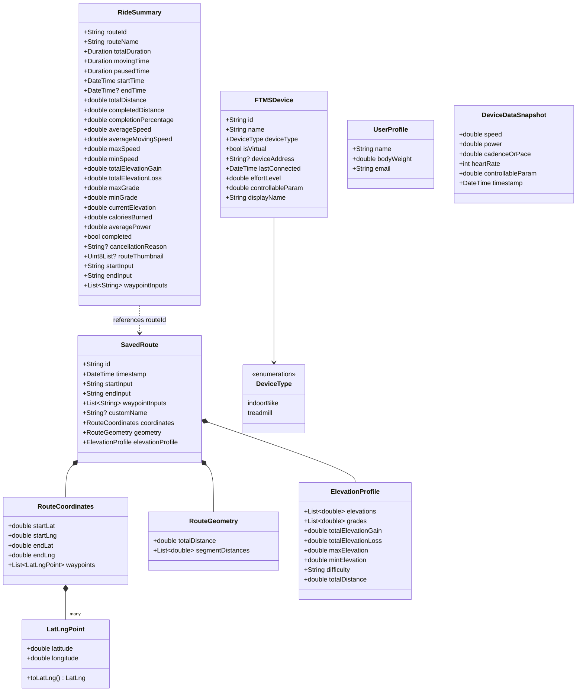
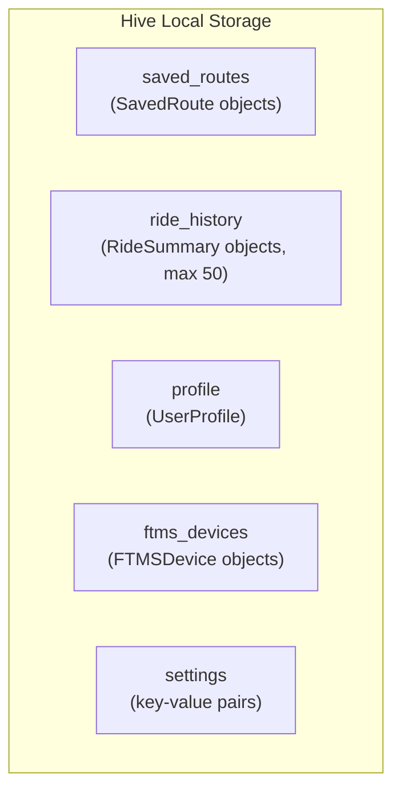

# Data Models

All persistent models use [Hive](https://docs.hivedb.dev/) for local NoSQL storage. Each model class has a registered Hive type adapter with a unique `typeId`.

## Model Relationships



## Hive Type Registry

| typeId | Class | Hive Box |
|--------|-------|----------|
| 0 | SavedRoute | `saved_routes` |
| 1 | RouteCoordinates | (embedded in SavedRoute) |
| 2 | LatLngPoint | (embedded in RouteCoordinates) |
| 3 | RouteGeometry | (embedded in SavedRoute) |
| 4 | ElevationProfile | (embedded in SavedRoute) |
| 6 | RideSummary | `ride_history` |
| 7 | UserProfile | `profile` |
| 8 | FTMSDevice | `ftms_devices` |
| 9 | DeviceType | (embedded in FTMSDevice) |
| 100 | DurationAdapter | (Duration serialization) |

## Storage Boxes



---

## SavedRoute

**File:** `lib/models/saved_route.dart`  
**Hive typeId:** 0

Represents a route fetched from OpenRouteService, including geographic coordinates, geometry, and elevation data.

| Field | Type | Description |
|-------|------|-------------|
| `id` | String | UUID, unique identifier |
| `timestamp` | DateTime | When the route was created |
| `startInput` | String | Original user input for start location |
| `endInput` | String | Original user input for end location |
| `waypointInputs` | List\<String\> | Original user inputs for intermediate waypoints |
| `customName` | String? | User-assigned route name |
| `coordinates` | RouteCoordinates | Start, end, and waypoint coordinate data |
| `geometry` | RouteGeometry | Distance measurements |
| `elevationProfile` | ElevationProfile | Elevation data, grades, gain/loss |

---

## RouteCoordinates

**File:** `lib/models/saved_route.dart`  
**Hive typeId:** 1

| Field | Type | Description |
|-------|------|-------------|
| `startLat` | double | Start latitude |
| `startLng` | double | Start longitude |
| `endLat` | double | End latitude |
| `endLng` | double | End longitude |
| `waypoints` | List\<LatLngPoint\> | Ordered list of all route waypoints |

---

## LatLngPoint

**File:** `lib/models/saved_route.dart`  
**Hive typeId:** 2

| Field | Type | Description |
|-------|------|-------------|
| `latitude` | double | Geographic latitude |
| `longitude` | double | Geographic longitude |

**Methods:**  
- `toLatLng()` → converts to `latlong2.LatLng` for use with mapping libraries

---

## RouteGeometry

**File:** `lib/models/saved_route.dart`  
**Hive typeId:** 3

| Field | Type | Description |
|-------|------|-------------|
| `totalDistance` | double | Total route distance in meters |
| `segmentDistances` | List\<double\> | Distance (meters) between each consecutive waypoint |

---

## ElevationProfile

**File:** `lib/models/saved_route.dart`  
**Hive typeId:** 4

| Field | Type | Description |
|-------|------|-------------|
| `elevations` | List\<double\> | Elevation (meters) at each waypoint |
| `grades` | List\<double\> | Grade (%) between consecutive waypoints |
| `totalElevationGain` | double | Total meters gained |
| `totalElevationLoss` | double | Total meters lost |
| `maxElevation` | double | Highest point in meters |
| `minElevation` | double | Lowest point in meters |

**Computed Properties:**

| Property | Type | Logic |
|----------|------|-------|
| `difficulty` | String | Easy (<10 m/km), Moderate (<30 m/km), Hard (≥30 m/km) |
| `totalDistance` | double | Approximated from grades and elevation deltas |

---

## RideSummary

**File:** `lib/models/ride_summary.dart`  
**Hive typeId:** 6

Comprehensive ride metrics generated at ride completion or cancellation. Contains 27 fields organized by category:

### Time Metrics

| Field | Type | Description |
|-------|------|-------------|
| `totalDuration` | Duration | Wall-clock time from start to end |
| `movingTime` | Duration | Time spent actively moving |
| `pausedTime` | Duration | Time spent paused |
| `startTime` | DateTime | When the ride started |
| `endTime` | DateTime? | When the ride ended |

### Distance Metrics

| Field | Type | Description |
|-------|------|-------------|
| `totalDistance` | double | Total route distance (meters) |
| `completedDistance` | double | Distance actually covered (meters) |
| `completionPercentage` | double | 0–100, percentage of route completed |

### Speed Metrics

| Field | Type | Description |
|-------|------|-------------|
| `averageSpeed` | double | Average speed including pauses (km/h) |
| `averageMovingSpeed` | double | Average speed excluding pauses (km/h) |
| `maxSpeed` | double | Maximum speed recorded (km/h) |
| `minSpeed` | double | Minimum speed recorded (km/h) |

### Elevation Metrics

| Field | Type | Description |
|-------|------|-------------|
| `totalElevationGain` | double | Total meters climbed |
| `totalElevationLoss` | double | Total meters descended |
| `maxGrade` | double | Steepest uphill grade (%) |
| `minGrade` | double | Steepest downhill grade (%) |
| `currentElevation` | double | Elevation at ride end (meters) |

### Performance Metrics

| Field | Type | Description |
|-------|------|-------------|
| `caloriesBurned` | double | Estimated calories |
| `averagePower` | double | Average power output (watts) |

### Route Reference

| Field | Type | Description |
|-------|------|-------------|
| `routeId` | String | ID of the SavedRoute |
| `routeName` | String | Display name (mutable) |
| `completed` | bool | Whether the ride reached the end |
| `cancellationReason` | String? | Reason if cancelled |
| `routeThumbnail` | Uint8List? | PNG screenshot of the route map |
| `startInput` | String | Original start location text |
| `endInput` | String | Original end location text |
| `waypointInputs` | List\<String\> | Original waypoint texts |

**Formatting Methods:**

| Method | Returns | Example |
|--------|---------|---------|
| `formattedDuration` | String | "1h 23m 45s" |
| `formattedDistance` | String | "12.3 km" |
| `formattedAverageSpeed` | String | "18.5 km/h" |

---

## FTMSDevice

**File:** `lib/models/ftms_device.dart`  
**Hive typeId:** 8

Persisted device descriptor for both real BLE and virtual devices.

| Field | Type | Description |
|-------|------|-------------|
| `id` | String | UUID identifier |
| `name` | String | Display name |
| `deviceType` | DeviceType | `indoorBike` or `treadmill` |
| `isVirtual` | bool | True for simulated devices |
| `deviceAddress` | String? | BLE MAC address (null for virtual) |
| `lastConnected` | DateTime | Last connection timestamp |
| `effortLevel` | double | 0–100 effort % (or speed for virtual) |
| `controllableParam` | double | Current resistance (bike) or incline (treadmill) |

**Computed Properties:**

| Property | Type | Description |
|----------|------|-------------|
| `displayName` | String | Name with "(Virtual)" suffix if virtual |

---

## DeviceType

**File:** `lib/models/ftms_device.dart`  
**Hive typeId:** 9

```dart
enum DeviceType {
  indoorBike,
  treadmill,
}
```

---

## UserProfile

**File:** `lib/models/user_profile.dart`  
**Hive typeId:** 7

| Field | Type | Description |
|-------|------|-------------|
| `name` | String | User display name |
| `bodyWeight` | double | Weight in kilograms (used for calorie/power calculations) |
| `email` | String | Email address (used as User-Agent for Nominatim API) |

---

## DeviceDataSnapshot

**File:** `lib/models/device_data_snapshot.dart`  
**Not persisted** — transient point-in-time device reading

| Field | Type | Description |
|-------|------|-------------|
| `speed` | double | Current speed (km/h) |
| `power` | double | Current power output (watts) |
| `cadenceOrPace` | double | RPM (bikes) or min/km (treadmills) |
| `heartRate` | int | Heart rate (bpm) |
| `controllableParam` | double | Current resistance (bike) or incline % (treadmill) |
| `timestamp` | DateTime | When the reading was taken |

Includes `copyWith()` for immutable updates.

---

## DurationAdapter

**File:** `lib/models/duration_adapter.dart`  
**Hive typeId:** 100

Custom Hive `TypeAdapter<Duration>` that serializes Duration as microseconds (int). Required because Hive does not natively support Dart's `Duration` type.
