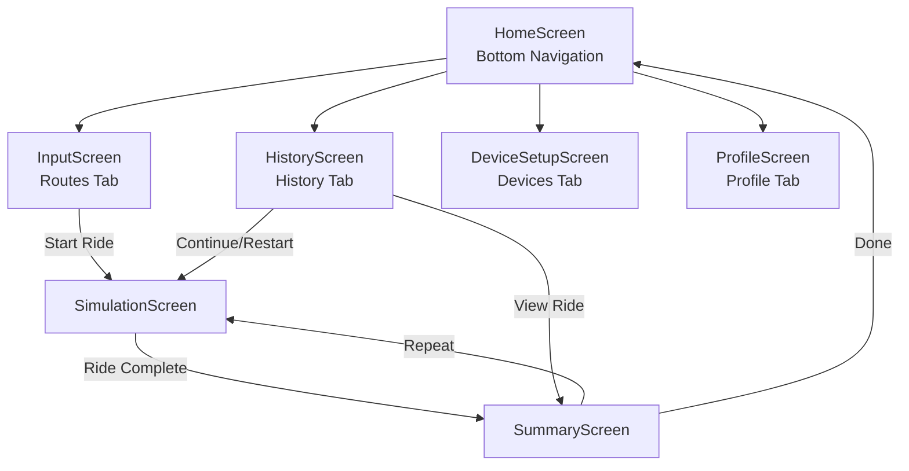
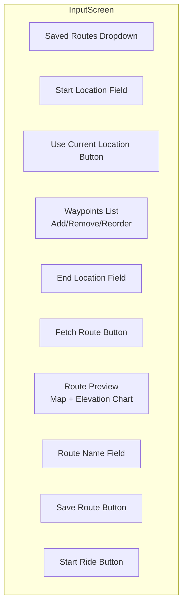
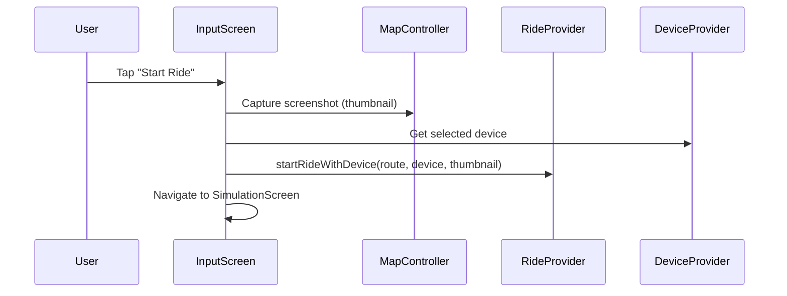
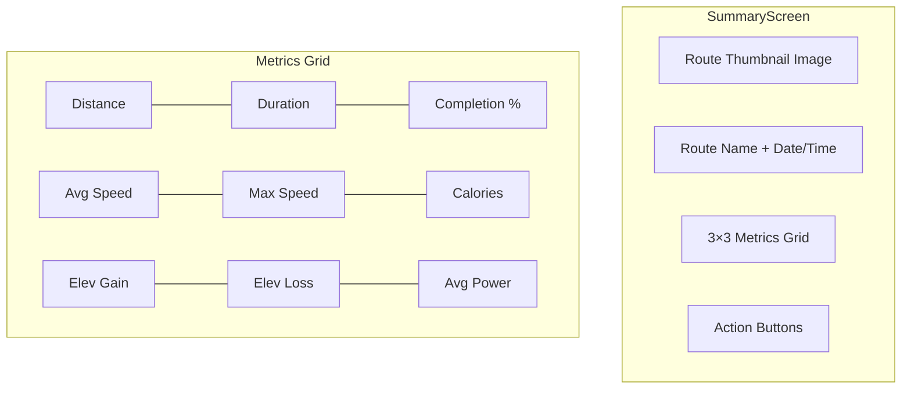
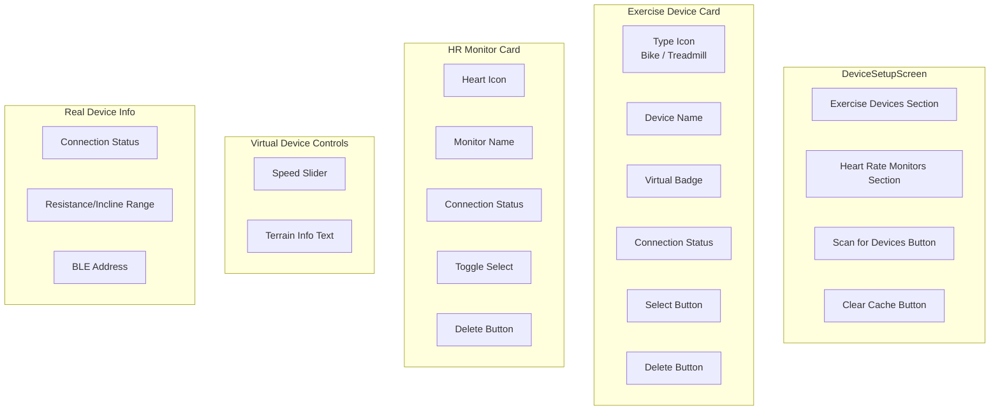

# Screens & Widgets

## Navigation Structure



---

## HomeScreen

**File:** `lib/screens/home_screen.dart`

The root navigation shell using `IndexedStack` for tab persistence and `BottomNavigationBar` for switching.

### Tabs

| Index | Label | Screen | Icon |
|-------|-------|--------|------|
| 0 | Routes | InputScreen | directions |
| 1 | History | HistoryScreen | history |
| 2 | Devices | DeviceSetupScreen | bluetooth |
| 3 | Profile | ProfileScreen | person |

### Behavior

- On launch, checks if user has a profile. If not, redirects to Profile tab.
- History tab refreshes data when reselected.
- Uses `IndexedStack` to preserve state across tab switches.

---

## InputScreen

**File:** `lib/screens/input_screen.dart`

Route planning screen where users enter start/end locations, add waypoints, preview routes on a map, and initiate rides.

### UI Layout



### Features

| Feature | Description |
|---------|-------------|
| **Location Input** | Text fields for start, end, and waypoints |
| **Current Location** | GPS button to auto-fill start with reverse-geocoded address |
| **Waypoints** | Dynamic list with add/remove/reorder capabilities |
| **Route Preview** | Interactive map showing the route polyline + elevation chart |
| **Save Route** | Persist route with optional custom name |
| **Load Route** | Dropdown to load a previously saved route |
| **Delete Route** | Remove a saved route |
| **Start Ride** | Captures map screenshot → initializes RideProvider → navigates to SimulationScreen |

### Start Ride Flow



---

## SimulationScreen

**File:** `lib/screens/simulation_screen.dart`

The live ride display. Shows the rider's position on a map in real-time, along with current metrics and controls.

### UI Layout

```mermaid
graph TD
    subgraph SimulationScreen
        TOP[Header Bar<br/>Route Name | Device Widget | Cancel]
        MAP[Interactive Map<br/>75% height<br/>Route + Rider Marker]
        CHART[Elevation Chart Overlay<br/>With progress indicator]
        CONTROLS[Control Bar<br/>Play/Pause | Intensity Slider | Map Mode]
        METRICS[Live Metrics<br/>Speed, Distance, Time, etc.]
    end
```

### Map Modes

| Mode | Description |
|------|-------------|
| **Navigation** | Camera follows rider with bearing rotation (POV view) |
| **Overview** | Static view showing the full route; manual pan/zoom |

### Controls

| Control | Action |
|---------|--------|
| Play/Pause button | Toggle ride state |
| Cancel button | End ride early with confirmation dialog |
| Intensity slider | Adjust 0.5×–2.0× workout intensity |
| Map mode toggle | Switch between navigation and overview |
| Recenter button | Re-focus map on rider (after manual pan) |

### Behavior

- **Auto-follow**: Map centers on rider position every tick. Disabled when user manually pans.
- **Connection banner**: Yellow "Reconnecting..." banner when a real device disconnects.
- **Auto-completion**: Navigates to SummaryScreen when ride reaches 100% or `completeRide()` is called.
- **Guard**: `_hasNavigatedToSummary` flag prevents duplicate navigation.
- **HR source label**: The heart rate metric card shows the data source — `(HRM)` for a standalone HR monitor, `(Device)` for exercise device HR, or no label for simulated HR.

---

## SummaryScreen

**File:** `lib/screens/summary_screen.dart`

Post-ride statistics display.

### UI Layout



### Actions

| Action | Description |
|--------|-------------|
| **Done** | Return to HomeScreen |
| **Repeat** | Start the same route again |
| **Delete** | Remove this ride from history |

---

## HistoryScreen

**File:** `lib/screens/history_screen.dart`

Scrollable list of past rides sorted by date (newest first).

### Ride Card

Each ride displays:
- Route name + thumbnail (if available)
- Date and time
- Key metrics: distance, duration, completion %
- Completion status badge

### Per-Ride Actions

| Action | Description |
|--------|-------------|
| **View** | Tap card → navigate to SummaryScreen |
| **Delete** | Remove ride from history |
| **Rename** | Change the ride's display name |
| **Continue** | Resume from where the ride left off |
| **Restart** | Start the same route from the beginning |

### Bulk Actions

| Action | Description |
|--------|-------------|
| **Clear All** | Delete all ride history (with confirmation dialog) |

### Empty State

Shows an icon and message when no rides exist.

---

## DeviceSetupScreen

**File:** `lib/screens/device_setup_screen.dart`

Device management screen for listing, selecting, and configuring fitness devices.

### UI Layout



### Features

| Feature | Description |
|---------|-------------|
| **Exercise Devices** | Listed under "Exercise Devices" section header |
| **HR Monitors** | Listed under "Heart Rate Monitors" section header with heart icon |
| **Select Device** | Highlight active device; creates FitnessDevice instance |
| **Select HR Monitor** | Toggle-select HR monitor; can coexist with selected exercise device |
| **Virtual Controls** | Speed slider for virtual devices |
| **Scan** | 10-second BLE scan with progress dialog; finds exercise devices and HR monitors |
| **Clear Cache** | Force re-detection of all BLE devices on next scan |
| **Delete** | Remove real devices only (virtual devices are permanent) |

---

## ProfileScreen

**File:** `lib/screens/profile_screen.dart`

Simple form for user profile management.

### Fields

| Field | Validation | Usage |
|-------|------------|-------|
| Name | Required | Display name |
| Email | Required, valid format | Nominatim User-Agent header |
| Body Weight (kg) | Required, numeric | Calorie/power calculations |

### Behavior

- Loads existing profile on init
- Validates all fields before save
- On first launch (no profile), HomeScreen redirects here
- After save, navigates back to Routes tab

---

## Reusable Widgets

### ElevationChart

**File:** `lib/widgets/elevation_chart.dart`

Line chart showing the route's elevation profile with a progress indicator.

| Prop | Type | Description |
|------|------|-------------|
| `route` | SavedRoute | Route with elevation data |
| `currentProgress` | double | 0.0–1.0 ride progress |

**Display:**
- X-axis: distance (km)
- Y-axis: elevation (m)
- Blue filled area under the curve
- Green dashed vertical line at current progress position
- Horizontal gridlines

Built with `fl_chart`.

### DeviceConnectionWidget

**File:** `lib/widgets/device_connection_widget.dart`

Compact device info badge for display in the simulation header.

| Prop | Type | Description |
|------|------|-------------|
| `device` | FTMSDevice | Device descriptor |

**Display:**
- Device name
- Type icon (bike 🚴 / treadmill 🏃)
- "Virtual" label for virtual devices
- Color: green (connected) / orange (disconnected)

### VirtualDeviceController

**File:** `lib/widgets/virtual_device_controller.dart`

Speed slider for virtual device control, used on the DeviceSetupScreen.

| Prop | Type | Description |
|------|------|-------------|
| `device` | FTMSDevice | Virtual device |
| `onChanged` | Callback | Speed change handler |

**Display:**
- Title: "Virtual Device Controls"
- Speed slider (0–50 km/h for bikes, 0–20 km/h for treadmills)
- Info text: "Resistance/Incline will be automatically controlled by route terrain"

Updates device parameters in DeviceProvider on slider release.
