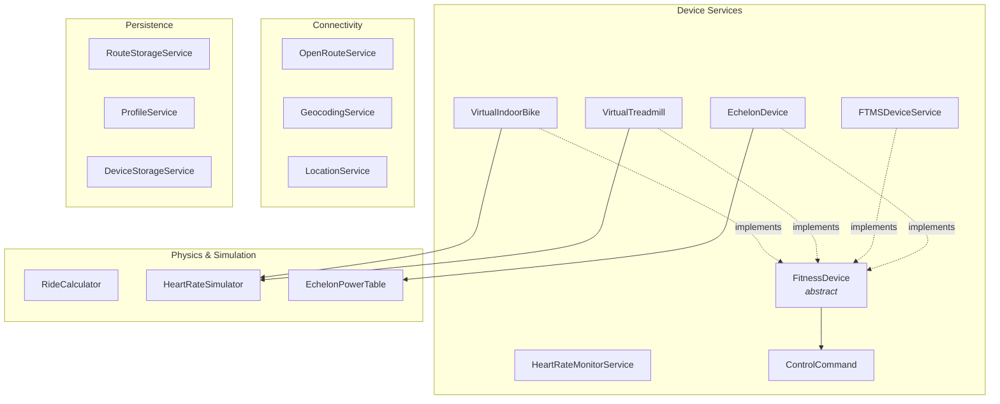
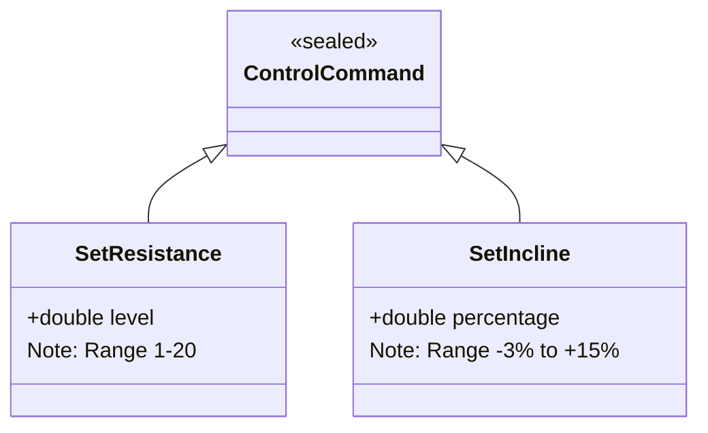
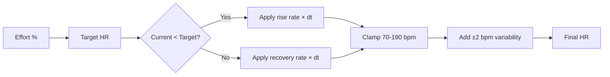

# Services

The service layer contains all business logic, organized into four categories: device interfaces, physics & simulation, connectivity, and persistence.

## Service Overview



---

## FitnessDevice (Abstract Interface)

**File:** `lib/services/fitness_device.dart`

Defines the contract that all device implementations must satisfy, whether virtual simulators or real BLE hardware.

### Abstract Methods

| Method | Signature | Description |
|--------|-----------|-------------|
| `connect()` | `Future<void>` | Establish device connection |
| `disconnect()` | `Future<void>` | Terminate connection |
| `sendControlCommand(cmd)` | `Future<void>` | Send resistance/incline command |
| `simulate(dt, grade, intensity)` | `DeviceDataSnapshot` | Get current device data |
| `getFTMSDataPacket()` | `List<int>?` | Raw protocol data (for testing) |
| `updateInputs(effort, param)` | `void` | Update virtual device parameters |

### Properties

| Property | Type | Description |
|----------|------|-------------|
| `isConnected` | bool | Current connection status |
| `connectionState` | Stream | Connection state changes |
| `deviceType` | DeviceType | indoorBike or treadmill |
| `minResistance` / `maxResistance` | double | Resistance range (bikes) |
| `minIncline` / `maxIncline` | double | Incline range (treadmills) |

---

## ControlCommand (Sealed Classes)

**File:** `lib/services/virtual_device_interface.dart`



---

## VirtualIndoorBike

**File:** `lib/services/virtual_indoor_bike.dart`

Physics-based indoor bike simulator. User controls speed via a slider; resistance is auto-controlled by route terrain.

### Simulation Model

| Output | Formula |
|--------|---------|
| Speed | User-controlled via slider (0–50 km/h) |
| Resistance | Auto-set from route grade, or manual override (1–20) |
| Cadence | Derived from speed and resistance |
| Power | $P = 100 \times \frac{v}{25} \times (1 + (R - 1) \times 0.15)$, capped at 400 W |
| Heart Rate | Via HeartRateSimulator |

### FTMS Data Packet

Generates a simulated Indoor Bike Data packet (UUID `0x2AD2`) containing speed, cadence, power, resistance, and heart rate — matching the real FTMS protocol format.

---

## VirtualTreadmill

**File:** `lib/services/virtual_treadmill.dart`

Treadmill simulator with auto-incline. User controls speed; incline follows route terrain with smoothing.

### Simulation Model

| Output | Formula |
|--------|---------|
| Speed | User-controlled via slider (0–25 km/h) |
| Incline | Auto-set from route grade, smoothed at 2%/sec rate |
| Pace | $\text{pace} = \frac{60}{v_{km/h}}$ (min/km) |
| Power | $P = m \times v_{m/s} \times (2 + 2.5 \times \text{grade})$ |
| Heart Rate | Via HeartRateSimulator |

### FTMS Data Packet

Generates a simulated Treadmill Data packet (UUID `0x2ACD`) with speed, pace, incline, and heart rate.

---

## HeartRateSimulator

**File:** `lib/services/heart_rate_simulator.dart`

Realistic heart rate dynamics with asymmetric response rates and variability.

### Model Parameters

| Parameter | Value | Description |
|-----------|-------|-------------|
| Resting HR | 70 bpm | Minimum HR |
| Max HR | 190 bpm | Maximum HR |
| Rise rate | 0.15/sec | How fast HR increases with effort |
| Recovery rate | 0.05/sec | How fast HR decreases (slower than rise) |
| Variability | ±2 bpm | Random noise for realism |

### HR Calculation



### HR Zones

| Zone | Range | Name |
|------|-------|------|
| 1 | < 60% | Recovery |
| 2 | 60–70% | Endurance |
| 3 | 70–80% | Tempo |
| 4 | 80–90% | Threshold |
| 5 | 90%+ | VO2 Max |

---

## HeartRateMonitorService

**File:** `lib/services/heart_rate_monitor_service.dart`

Standalone BLE heart rate monitor connection and data streaming. Uses the standard GATT Heart Rate Service (0x180D) rather than the `FitnessDevice` interface — HR monitors don't have speed, power, or control commands.

### Key Methods

| Method | Returns | Description |
|--------|---------|-------------|
| `detectDevice(bleDevice)` | `FTMSDevice?` | Static — connects, checks for 0x180D + 0x2A37, returns device model |
| `connect()` | `Future<bool>` | Connects, discovers services, subscribes to HR notifications |
| `disconnect()` | `Future<void>` | Clean disconnect, resets state |
| `parseHeartRate(data)` | `int` | Static — parses GATT HR Measurement: flags byte determines UINT8 vs UINT16 format |

### Properties

| Property | Type | Description |
|----------|------|-------------|
| `isConnected` | `bool` | Current connection status |
| `currentHeartRate` | `int` | Latest HR value (0 when disconnected) |
| `connectionState` | `Stream<bool>` | Connection state changes |
| `heartRateStream` | `Stream<int>` | Parsed HR values as they arrive |

### Auto-Reconnect

On unexpected disconnect, the service waits 2 seconds then retries `connect()`. The `_isReconnecting` flag prevents recursive reconnect loops.

---

## RideCalculator

**File:** `lib/services/ride_calculator.dart`

Static utility class for physics calculations used throughout the simulation.

### Methods

| Method | Input | Output | Description |
|--------|-------|--------|-------------|
| `calculateAverageSpeed` | distance (m), duration | km/h | Average speed |
| `calculateAdjustedSpeed` | baseSpeed, grade, multiplier, factor | km/h | Grade-adjusted speed |
| `calculateGrade` | elev1, elev2, distance | decimal | Grade between two points |
| `calculateGrades` | elevations[], distances[] | grades[] | Per-segment grades |
| `calculateElevationChange` | elevations[] | ElevationChange | Total gain and loss |
| `estimatePower` | speed, grade, weight, bikeWeight | watts | Power from physics model |
| `estimateCalories` | distance, elevation, duration, weight | kcal | Calorie estimation |
| `calculateAveragePower` | PowerSample[] | watts | Time-weighted average |

### Power Estimation Formula

$$P = m g v \sin(\theta) + \frac{1}{2} \rho C_d A v^3 + C_{rr} m g v$$

Where:
- $m$ = rider + bike mass (kg)
- $g$ = 9.81 m/s²
- $v$ = speed (m/s)
- $\theta$ = road grade (radians)
- $\rho$ = air density (1.225 kg/m³)
- $C_d A$ = drag coefficient × frontal area
- $C_{rr}$ = rolling resistance coefficient

### Calorie Estimation

1. Calculate base MET from average speed
2. Add elevation bonus (extra MET per meter of gain)
3. $\text{Calories} = \text{MET} \times \text{weight}_{kg} \times \text{hours}$

---

## EchelonPowerTable

**File:** `lib/services/echelon_power_table.dart`

Lookup table for converting Echelon bike cadence + resistance into power (watts). Echelon bikes do not report power directly.

### Table Structure

- 33 resistance levels (0–32)
- 11 cadence ranges (0–9, 10–19, ..., 100+)
- Linear interpolation between cadence range boundaries

### Example Values

| Resistance | Cadence 50 | Cadence 80 | Cadence 100 |
|------------|-----------|-----------|------------|
| 1 | ~15 W | ~30 W | ~40 W |
| 16 | ~80 W | ~150 W | ~200 W |
| 32 | ~150 W | ~280 W | ~370 W |

---

## OpenRouteService

**File:** `lib/services/openroute_service.dart`

Client for the [OpenRouteService API](https://openrouteservice.org/) to fetch cycling routes with elevation data.

### Configuration

| Setting | Value |
|---------|-------|
| Endpoint | `https://api.openrouteservice.org/v2/directions/cycling-regular` |
| Auth | API key from `.env` file |
| Elevation | Enabled (3D coordinates) |

### Methods

| Method | Description |
|--------|-------------|
| `getRoute(start, end, waypoints?)` | Fetch route from API |
| `parseRouteData(response)` | Extract coordinates, elevations, distances |
| `calculateSegmentDistances(coords)` | Compute distances between waypoints |

### Polyline Decoding

Decodes Google Encoded Polyline Format with 3D elevation support:
- Latitude/longitude at 1e-5 precision
- Elevation at 1e-2 precision

---

## GeocodingService

**File:** `lib/services/geocoding_service.dart`

Converts between text addresses and geographic coordinates using a multi-strategy approach.

### Geocoding Strategy

```mermaid
flowchart TD
    INPUT[Address Text] --> COORD{Looks like coordinates?}
    COORD -->|Yes, e.g. "40.7,-74.0"| PARSE[Parse as LatLng]
    COORD -->|No| NATIVE{macOS?}
    NATIVE -->|No| NAT_GEO[Try Native Geocoding]
    NATIVE -->|Yes| NOM[Nominatim API]
    NAT_GEO -->|Success| RESULT[Return LatLng]
    NAT_GEO -->|Failure| NOM
    NOM -->|Success| RESULT
    NOM -->|Failure| ERROR[Throw Exception]
    PARSE --> RESULT
```

### Nominatim Rate Limiting

- Maximum 1 request per second
- User-Agent header set from user's profile email
- Used as fallback when native geocoding is unavailable

---

## LocationService

**File:** `lib/services/location_service.dart`

Thin wrapper around the `geolocator` package for GPS operations.

| Method | Description |
|--------|-------------|
| `isLocationServiceEnabled()` | Check if GPS is enabled |
| `checkPermission()` | Check current location permission |
| `requestPermission()` | Request location permission from user |
| `getCurrentPosition()` | Get current GPS coordinates (high accuracy) |
| `getLastKnownPosition()` | Get cached position (faster, may be stale) |

---

## RouteStorageService

**File:** `lib/services/route_storage_service.dart`

Hive-based persistence for routes and ride history.

### Storage Boxes

| Box Name | Content | Limit |
|----------|---------|-------|
| `saved_routes` | SavedRoute objects | Unlimited |
| `ride_history` | RideSummary objects | 50 max (auto-prune oldest) |
| `settings` | Key-value pairs (e.g., last route ID) | — |

### Methods

**Routes:**

| Method | Description |
|--------|-------------|
| `saveRoute(route)` | Save or update a route |
| `deleteRoute(id)` | Delete a route by ID |
| `updateRouteName(id, name)` | Rename a route |
| `getRouteById(id)` | Fetch single route |
| `getAllRoutes()` | Fetch all routes |
| `getLastRoute()` | Get most recently used route |

**Ride History:**

| Method | Description |
|--------|-------------|
| `saveRideHistory(summary)` | Save ride; auto-prune if >50 |
| `getRideHistory(limit)` | Get rides, newest first |
| `getRideHistoryForRoute(routeId)` | Get rides for a specific route |
| `deleteRideHistory(summary)` | Delete a single ride |
| `updateRideName(summary, name)` | Rename a ride |
| `clearAllHistory()` | Delete all ride history |

**Utilities:**

| Method | Description |
|--------|-------------|
| `clearAllRoutes()` | Delete all routes |
| `getStorageStats()` | Get count of routes and rides |

---

## ProfileService

**File:** `lib/services/profile_service.dart`

Hive-based user profile persistence.

| Method | Description |
|--------|-------------|
| `saveProfile(profile)` | Save user profile |
| `getProfile()` | Retrieve profile |
| `hasProfile()` | Check if profile exists |
| `deleteProfile()` | Remove profile |

Includes corruption recovery: if the Hive box is corrupted, it is deleted and recreated.

---

## DeviceStorageService

**File:** `lib/services/device_storage_service.dart`

Hive-based device persistence with virtual device bootstrapping.

### Default Devices

On first launch, two virtual devices are created automatically:
1. **Virtual Indoor Bike** — default speed 20 km/h
2. **Virtual Treadmill** — default speed 8 km/h

### Methods

| Method | Description |
|--------|-------------|
| `getAllDevices()` | Get all devices (virtual + real) |
| `getDevice(id)` | Get device by ID |
| `saveDevice(device)` | Save or update device |
| `deleteDevice(id)` | Delete device |
| `getLastUsedDevice()` | Get last active device |
| `setLastUsedDeviceId(id)` | Remember active device |
| `updateDeviceParameters(id, effort, param)` | Update effort/controllable param |
