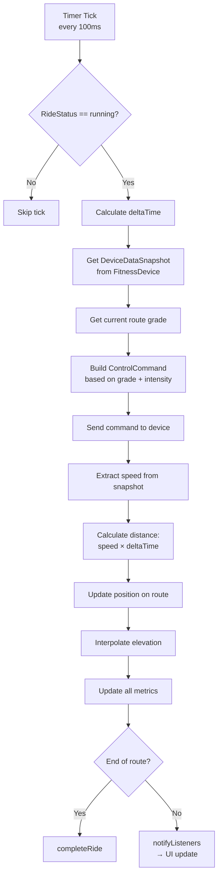
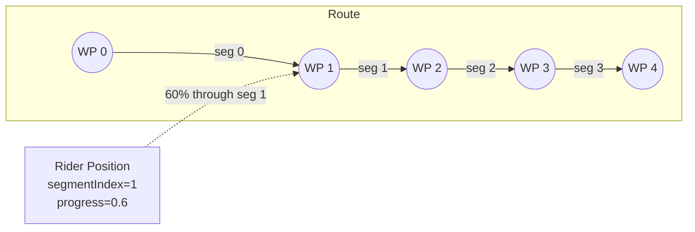
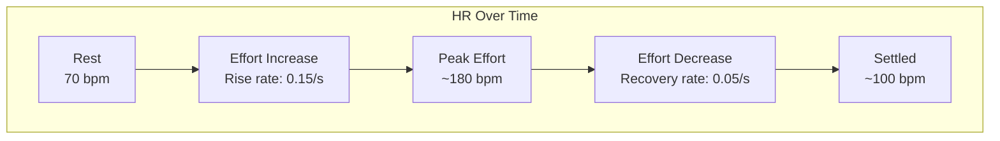
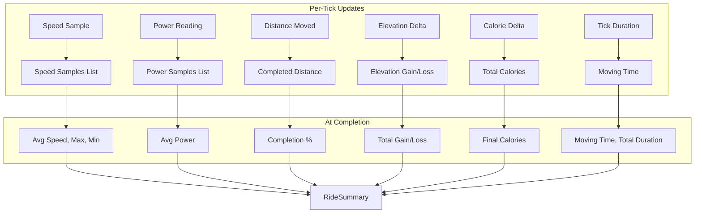
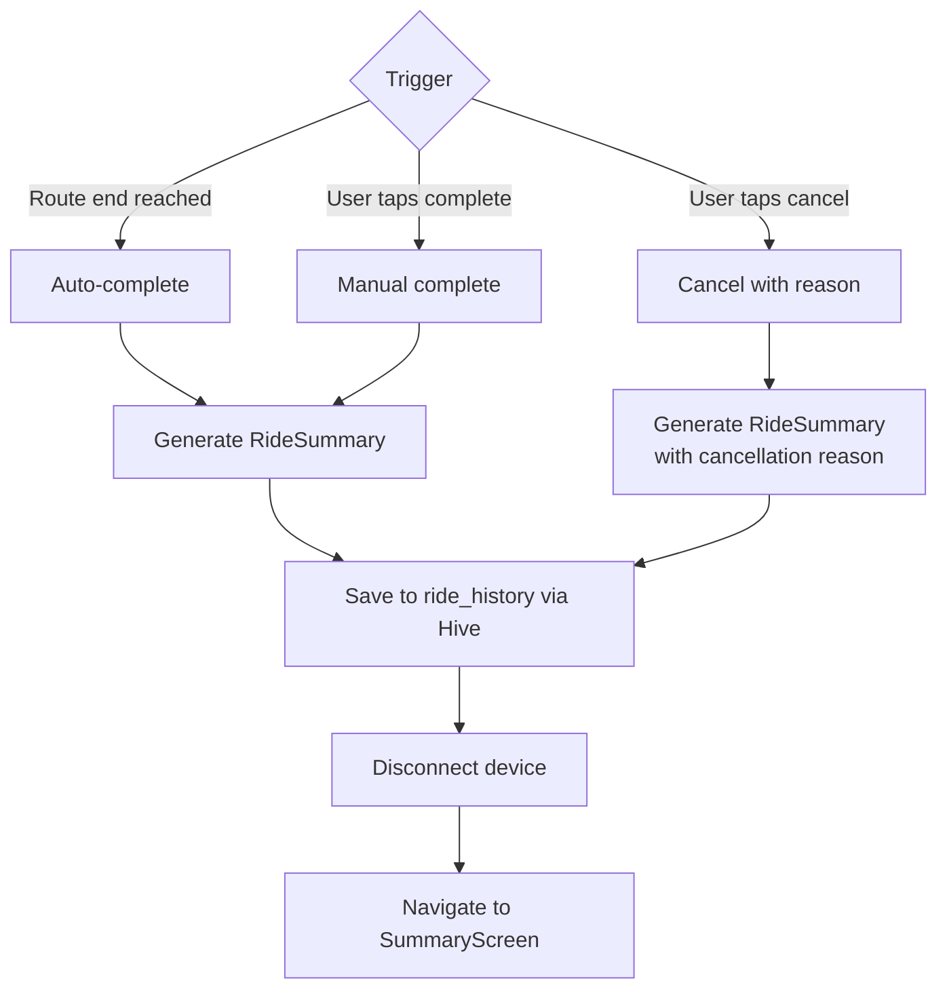

# Simulation Engine

The simulation engine runs the core ride loop, handling position tracking along the route, physics calculations, device interaction, and metrics aggregation.

## Simulation Loop

The ride runs on a `Timer.periodic` at 100ms intervals (configurable via `Constants.simulationTickInterval`).



## Position Tracking

The rider's position is tracked as a segment index + progress within that segment:



### Position Update Algorithm

1. Convert speed (km/h) to distance moved (meters) for this tick
2. Consume distance from current segment
3. If remaining distance > current segment length, advance to next segment
4. Interpolate lat/lng within the current segment based on progress (0.0–1.0)
5. Interpolate bearing from segment direction

```
completedDistance += distanceMoved
progressInSegment = distanceMoved / segmentLength
currentPosition = lerp(segStart, segEnd, progressInSegment)
```

## Grade-Based Control

The simulation automatically adjusts device resistance (bikes) or incline (treadmills) based on the route terrain.

### For Indoor Bikes


### For Treadmills


## Speed Calculation

### Real Devices
Speed is read directly from the device's data characteristic (FTMS packet or Echelon data).

### Virtual Devices
Speed is user-controlled via slider, then grade-adjusted:

$$v_{adjusted} = v_{base} \times m \times (1 - g \times f)$$

Where:
- $v_{base}$ = user-set speed (km/h)
- $m$ = speed multiplier constant
- $g$ = current grade (decimal)
- $f$ = grade adjustment factor (0.1)

## Power Calculation

### Real FTMS Devices
Power is read from the FTMS data characteristic (field present when bit 6 is set).

### Echelon Devices
Power is derived from cadence + resistance via the `EchelonPowerTable` lookup.

### Virtual Indoor Bike

$$P = 100 \times \frac{v}{25} \times (1 + (R - 1) \times 0.15)$$

Capped at 400 W.

### Virtual Treadmill (Running Power)

$$P = m \times v_{m/s} \times (2 + 2.5 \times \text{grade})$$

### Physics-Based Estimation (RideCalculator)

Used for calorie estimation and general power metrics:

$$P = P_{gravity} + P_{aero} + P_{rolling}$$

$$P_{gravity} = (m_{rider} + m_{bike}) \times g \times v \times \sin(\theta)$$

$$P_{aero} = \frac{1}{2} \times \rho \times C_d \times A \times v^3$$

$$P_{rolling} = C_{rr} \times (m_{rider} + m_{bike}) \times g \times v$$

## Calorie Estimation

$$\text{Calories} = \text{MET} \times \text{weight}_{kg} \times \text{hours}$$

Base MET is determined by average speed:

| Speed Range | Base MET |
|-------------|----------|
| < 16 km/h | ~4.0 |
| 16–19 km/h | ~6.0 |
| 19–22 km/h | ~8.0 |
| 22–26 km/h | ~10.0 |
| > 26 km/h | ~12.0 |

Elevation bonus adds additional MET based on meters climbed per kilometer.

## Heart Rate Simulation

For virtual devices, heart rate follows an exponential approach model:



Key characteristics:
- HR rises 3× faster than it recovers (asymmetric response)
- Random ±2 bpm variability per tick
- Clamped between 70 (resting) and 190 (max) bpm

## Metrics Aggregation

All metrics are updated every 100ms tick and accumulated:



## Workout Intensity

Users can adjust workout intensity via a slider (0.5× to 2.0×):

| Intensity | Effect on Resistance/Incline | Use Case |
|-----------|------------------------------|----------|
| 0.5× | Halved grade effect | Recovery ride |
| 1.0× | Real-world grade | Normal training |
| 1.5× | 50% harder than real grade | Hard training |
| 2.0× | Double the grade effect | Maximum challenge |

The intensity multiplier is applied to the grade value before converting to resistance/incline commands.

## Ride Completion



### RideSummary Generation

At completion, the following are computed from accumulated samples:

| Metric | Computation |
|--------|-------------|
| Average Speed | Mean of speed samples |
| Average Moving Speed | completedDistance / movingTime |
| Max/Min Speed | Tracked per-tick |
| Elevation Gain/Loss | Sum of positive/negative deltas |
| Average Power | Time-weighted average of PowerSamples |
| Completion % | (completedDistance / totalDistance) × 100 |
| Calories | Accumulated per-tick estimate |
