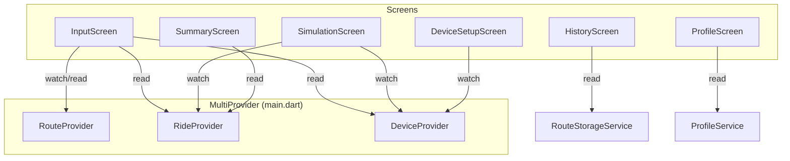
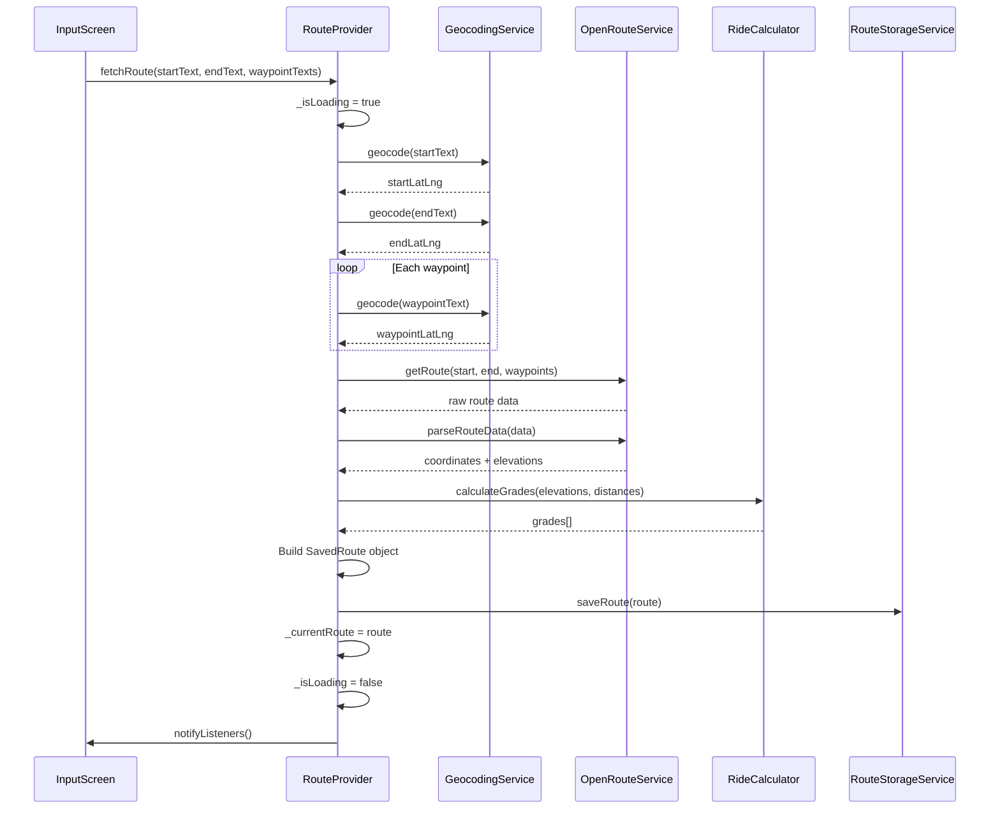
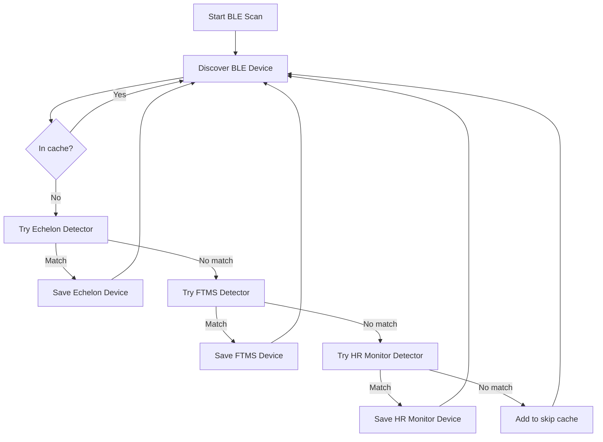
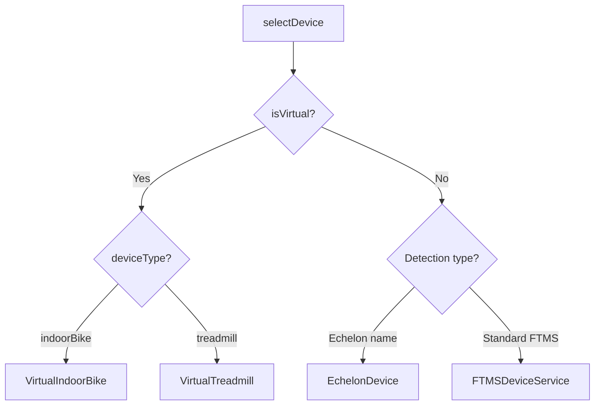
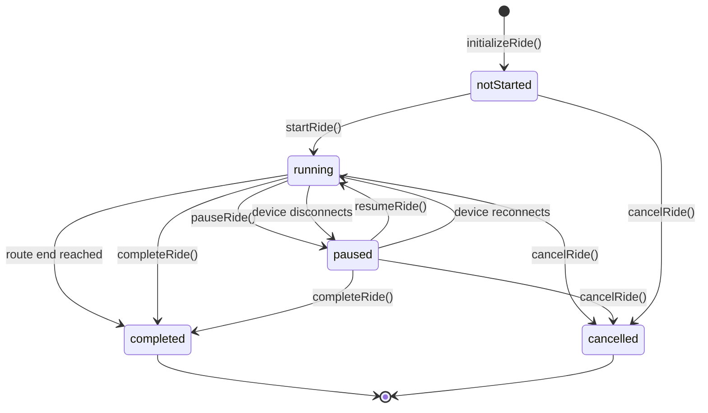
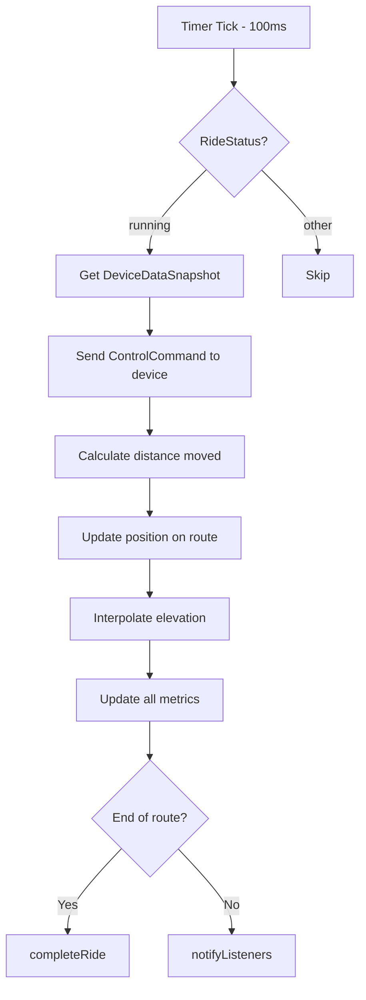
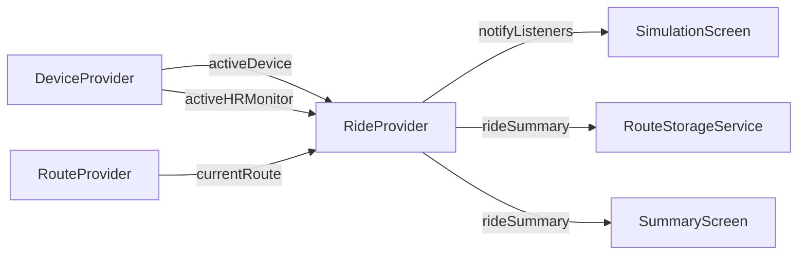

# State Management

Free Ride uses [Provider](https://pub.dev/packages/provider) with `ChangeNotifier` for reactive state management. Three providers are registered at the app root via `MultiProvider` and are accessible throughout the widget tree.

## Provider Architecture

---

## RouteProvider

**File:** `lib/providers/route_provider.dart`

Manages the lifecycle of route creation, loading, and storage. Orchestrates geocoding, API calls, and persistence.

### State

| Field | Type | Description |
|-------|------|-------------|
| `_currentRoute` | SavedRoute? | Currently loaded/created route |
| `_isLoading` | bool | Whether a route fetch is in progress |
| `_error` | String? | Error message from last operation |

### Methods

| Method | Purpose |
|--------|---------|
| `fetchRoute(start, end, waypoints?)` | Geocode inputs → fetch from OpenRouteService → calculate grades → save |
| `loadRoute(route)` | Load an existing saved route into state |
| `setCurrentRoute(route)` | Set route directly (for repeating rides) |
| `clearRoute()` | Clear the current route |
| `updateRouteName(customName)` | Rename via storage service |

### Flow: Route Fetching

---

## DeviceProvider

**File:** `lib/providers/device_provider.dart`

Manages BLE device scanning, detection, selection, and lifecycle. Maintains both the persisted device descriptor (`FTMSDevice` model) and the active device instance (`FitnessDevice` interface).

### State

| Field | Type | Description |
|-------|------|-------------|
| `_selectedDevice` | FTMSDevice? | Persisted device model descriptor |
| `_activeDevice` | FitnessDevice? | Live device instance (virtual or BLE) |
| `_selectedHRMonitor` | FTMSDevice? | Selected HR monitor model |
| `_activeHRMonitor` | HeartRateMonitorService? | Live HR monitor instance |
| `_isScanning` | bool | Whether a BLE scan is active |
| `_availableDevices` | List\<FTMSDevice\> | All saved devices (exercise + HR monitors) |
| `_deviceCache` | Set\<String\> | BLE addresses already tested (skip on rescan) |

### Device Detection Pipeline

### Device Factory

### Methods

| Method | Purpose |
|--------|---------|
| `init()` | Load saved devices + last used device + last used HR monitor |
| `selectDevice(device)` | Set active device, create FitnessDevice instance (routes HR monitors to `selectHRMonitor`) |
| `selectHRMonitor(device)` | Set active HR monitor, create HeartRateMonitorService instance |
| `deselectHRMonitor()` | Disconnect and clear active HR monitor |
| `startScan()` | 10-sec BLE scan; test each with detectors (Echelon, FTMS, HR Monitor); save new devices |
| `stopScan()` | Stop active BLE scan |
| `deleteDevice(id)` | Remove device from storage |
| `updateDeviceParameters(effort, param)` | Update effort level / controllable parameter |
| `clearDeviceCache()` | Force rescan of all devices |

---

## RideProvider

**File:** `lib/providers/ride_provider.dart`

The most complex provider. Manages the ride state machine, simulation loop, position tracking, metrics aggregation, and ride completion.

### State Machine

### State Fields

**Position:**

| Field | Type | Description |
|-------|------|-------------|
| `_currentSegmentIndex` | int | Index of the current route segment |
| `_progressInSegment` | double | 0.0–1.0 progress within current segment |
| `_currentPosition` | LatLng | Interpolated rider position |
| `_currentBearing` | double | Direction of travel (degrees) |

**Time:**

| Field | Type | Description |
|-------|------|-------------|
| `_totalDuration` | Duration | Wall-clock elapsed |
| `_movingTime` | Duration | Time spent moving |
| `_pausedTime` | Duration | Time spent paused |
| `_startTime` | DateTime? | Ride start timestamp |

**Metrics:**

| Field | Type | Description |
|-------|------|-------------|
| `_completedDistance` | double | Distance covered (meters) |
| `_currentSpeed` | double | Current speed (km/h) |
| `_maxSpeed` / `_minSpeed` | double | Speed extremes |
| `_speedSamples` | List\<double\> | For averaging |
| `_currentElevation` | double | Interpolated elevation |
| `_elevationGain` / `_elevationLoss` | double | Accumulated climb/descent |
| `_currentPower` | double | Current power (watts) |
| `_powerSamples` | List\<PowerSample\> | Timestamped power readings |
| `_currentCadence` | double | Current cadence/pace |
| `_currentHeartRate` | int | Current HR (bpm) |
| `_hrMonitor` | HeartRateMonitorService? | Optional standalone HR monitor |
| `_caloriesBurned` | double | Running calorie total |
| `_workoutIntensity` | double | 0.5–2.0 multiplier |

### Simulation Loop

The ride runs a timer at 100ms intervals:

### Key Methods

| Method | Purpose |
|--------|---------|
| `initializeRide(route, thumbnail?)` | Setup ride state without device |
| `startRideWithDevice(route, device, thumbnail?, hrMonitor?)` | Full setup: connect device + optional HR monitor + start |
| `startRide()` | Begin simulation loop |
| `pauseRide()` | Pause timer and metrics |
| `resumeRide()` | Resume from pause |
| `completeRide()` | Generate RideSummary, save to history |
| `cancelRide()` | Generate summary with cancellation reason |
| `setWorkoutIntensity(value)` | Set 0.5×–2.0× intensity multiplier |

### Metrics Calculation

On each 100ms tick:

1. **Speed** — from device data or calculated from base speed + grade adjustment
2. **Distance** — `speed × deltaTime`
3. **Position** — interpolate along route segments
4. **Elevation** — interpolate between segment elevation values
5. **Power** — from device data or estimated via RideCalculator
6. **Calories** — accumulated via RideCalculator.estimateCalories
7. **Heart Rate** — from device data
7. **Heart Rate** — from HR monitor (highest priority), device data, or simulated

### Provider Communication

